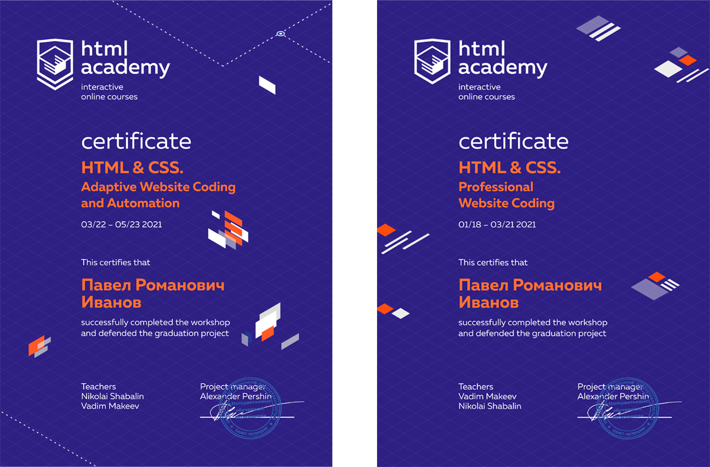

  

## 1. Задание 1: :orange_book:

- На перекресток нужно установить светофор для проезда машин. Тебе нужно написать инструкцию по тому, как этот светофор будет работать. 
Заказчик в требованиях к светофору указал, что светофор должен состоять из 3 блоков:

- 1.1. Желтый :page_facing_up:

- 1.2. Желтый :page_facing_up:

- 1.3. Красный :page_facing_up:

## 2. Задание 2: :orange_book:

- Ты уже не мало времени работаешь в Тинькофф и не раз сталкивался с нашим сервисом. Представь, что у тебя есть возможность глобально изменить любой процесс, чтобы сервис был еще круче. Ресурсы не ограничены. Что бы ты изменил и что нам это даст?

## 3. Задание 3: :orange_book:

- Попробуй составить json, содержащий информацию о человеке, а именно:

- 3.1. ФИО – Иванов Иван Иванович :page_facing_up:

- 3.2. Возраст – 20 лет :page_facing_up:

- 3.3. Пол - мужской :page_facing_up:

- 3.4. Город проживания - Москва :page_facing_up:

---

  
</>

  

|  Year  | Сertificate             |
| ------------- |:------------------:|
| 01.2021 - 03.2021    | HTML & CSS. Professional Website Coding    |
| 03.2021 - 05.2021     | HTML & CSS. Adaptive Website Coding and Automation |

---

  

  

  

  

  

[check-image]: https://github.com/htmlacademy-adaptive/1629453-pink-22/workflows/Project%20check/badge.svg?branch=master
[check-url]: https://github.com/htmlacademy-adaptive/1629453-pink-22/actions
[@htmlacademy]: https://htmlacademy.ru
[figma]: https://www.figma.com/file/ASeQqd0fG7Ug51ssFdapgv/HTML-1-%2F-%D0%A1%D0%B5%D0%B4%D0%BE%D0%BD%D0%B0-(30)?node-id=0%3A1
